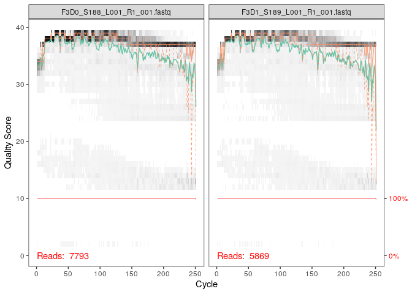
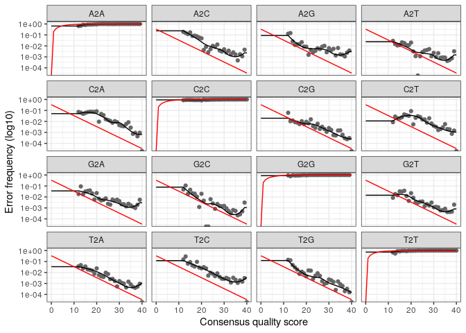
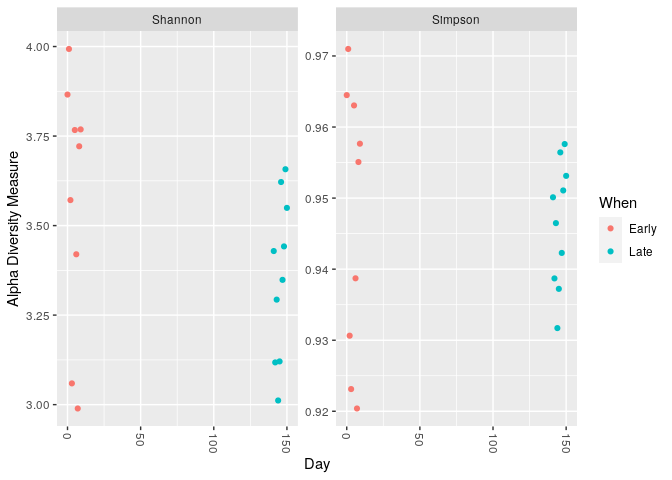
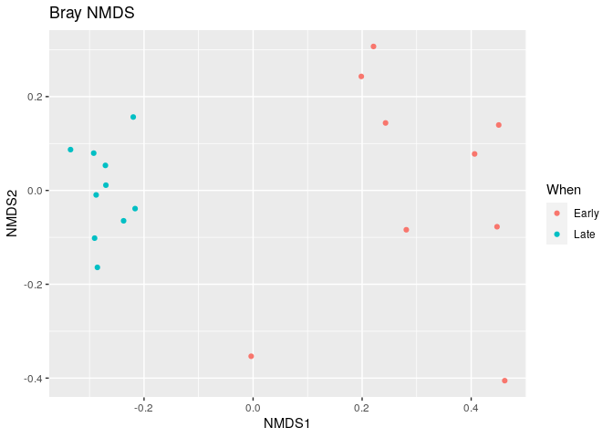
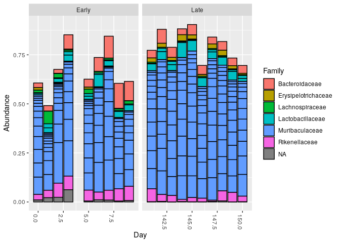

R Notebook
================

``` r
# Charger le package DADA2
# Le packageVersion permet de vérifier la version de dada2 installée.
 library(dada2); packageVersion("dada2")
```

    ## Loading required package: Rcpp

    ## [1] '1.28.0'

``` r
# Définir le chemin vers le répertoire contenant les fichiers fastq
# Modifie ce chemin pour qu'il pointe vers le dossier contenant tes données après extraction.
path <- "~/MiSeq_SOP"  # Remplace "~/MiSeq_SOP" par le chemin correct vers tes fichiers fastq.
```

``` r
list.files(path)  # Liste tous les fichiers dans le répertoire pour vérifier qu'ils sont bien détectés.
```

    ##  [1] "F3D0_S188_L001_R1_001.fastq"   "F3D0_S188_L001_R2_001.fastq"  
    ##  [3] "F3D1_S189_L001_R1_001.fastq"   "F3D1_S189_L001_R2_001.fastq"  
    ##  [5] "F3D141_S207_L001_R1_001.fastq" "F3D141_S207_L001_R2_001.fastq"
    ##  [7] "F3D142_S208_L001_R1_001.fastq" "F3D142_S208_L001_R2_001.fastq"
    ##  [9] "F3D143_S209_L001_R1_001.fastq" "F3D143_S209_L001_R2_001.fastq"
    ## [11] "F3D144_S210_L001_R1_001.fastq" "F3D144_S210_L001_R2_001.fastq"
    ## [13] "F3D145_S211_L001_R1_001.fastq" "F3D145_S211_L001_R2_001.fastq"
    ## [15] "F3D146_S212_L001_R1_001.fastq" "F3D146_S212_L001_R2_001.fastq"
    ## [17] "F3D147_S213_L001_R1_001.fastq" "F3D147_S213_L001_R2_001.fastq"
    ## [19] "F3D148_S214_L001_R1_001.fastq" "F3D148_S214_L001_R2_001.fastq"
    ## [21] "F3D149_S215_L001_R1_001.fastq" "F3D149_S215_L001_R2_001.fastq"
    ## [23] "F3D150_S216_L001_R1_001.fastq" "F3D150_S216_L001_R2_001.fastq"
    ## [25] "F3D2_S190_L001_R1_001.fastq"   "F3D2_S190_L001_R2_001.fastq"  
    ## [27] "F3D3_S191_L001_R1_001.fastq"   "F3D3_S191_L001_R2_001.fastq"  
    ## [29] "F3D5_S193_L001_R1_001.fastq"   "F3D5_S193_L001_R2_001.fastq"  
    ## [31] "F3D6_S194_L001_R1_001.fastq"   "F3D6_S194_L001_R2_001.fastq"  
    ## [33] "F3D7_S195_L001_R1_001.fastq"   "F3D7_S195_L001_R2_001.fastq"  
    ## [35] "F3D8_S196_L001_R1_001.fastq"   "F3D8_S196_L001_R2_001.fastq"  
    ## [37] "F3D9_S197_L001_R1_001.fastq"   "F3D9_S197_L001_R2_001.fastq"  
    ## [39] "filtered"                      "HMP_MOCK.v35.fasta"           
    ## [41] "Mock_S280_L001_R1_001.fastq"   "Mock_S280_L001_R2_001.fastq"  
    ## [43] "mouse.dpw.metadata"            "mouse.time.design"            
    ## [45] "stability.batch"               "stability.files"

``` r
# Obtenir les noms des fichiers fastq pour les reads forward (R1) et reverse (R2)
# Utilisation de la fonction list.files() pour lister les fichiers et extraction par motif ("_R1_001.fastq" pour forward).
fnFs <- sort(list.files(path, pattern="_R1_001.fastq", full.names = TRUE))  # Fichiers forward
fnRs <- sort(list.files(path, pattern="_R2_001.fastq", full.names = TRUE))  # Fichiers reverse
```

``` r
# Extraire les noms des échantillons à partir des noms de fichiers
# On suppose que les noms des fichiers sont de la forme : "SAMPLENAME_XXX.fastq".
sample.names <- sapply(strsplit(basename(fnFs), "_"), `[`, 1)
```

``` r
# Visualiser les profils de qualité des lectures
# plotQualityProfile permet de voir la qualité de séquençage sur les premiers fichiers forward.
plotQualityProfile(fnFs[1:2])  # Visualiser la qualité des deux premiers fichiers forward
```

<!-- -->

``` r
plotQualityProfile(fnRs[1:2])  # Visualiser la qualité des deux premiers fichiers reverse
```

<!-- -->

``` r
# Définir les chemins pour les fichiers fastq filtrés
# On crée un dossier "filtered" dans le répertoire de travail pour stocker les fichiers filtrés.
filtFs <- file.path(path, "filtered", paste0(sample.names, "_F_filt.fastq.gz"))
filtRs <- file.path(path, "filtered", paste0(sample.names, "_R_filt.fastq.gz"))
names(filtFs) <- sample.names
names(filtRs) <- sample.names
```

``` r
# Filtrage et trimming des séquences
# La fonction filterAndTrim filtre les séquences en fonction des paramètres définis comme truncLen et maxEE.
out <- filterAndTrim(fnFs, filtFs, fnRs, filtRs, 
                     truncLen=c(240,160),  # Longueur de troncature pour les lectures forward et reverse.
                     maxN=0,  # Aucun 'N' n'est autorisé dans les séquences.
                     maxEE=c(2,2),  # Maximum d'erreurs attendues autorisées par lecture.
                     truncQ=2,  # Troncature sur la base de la qualité.
                     rm.phix=TRUE,  # Supprimer les séquences PhiX, un contaminant courant.
                     compress=TRUE,  # Comprimer les fichiers de sortie.
                     multithread=TRUE)  # Utiliser plusieurs cœurs pour accélérer le traitement.
head(out)  # Afficher les premières lignes du résultat pour voir combien de séquences ont été filtrées.
```

    ##                               reads.in reads.out
    ## F3D0_S188_L001_R1_001.fastq       7793      7113
    ## F3D1_S189_L001_R1_001.fastq       5869      5299
    ## F3D141_S207_L001_R1_001.fastq     5958      5463
    ## F3D142_S208_L001_R1_001.fastq     3183      2914
    ## F3D143_S209_L001_R1_001.fastq     3178      2941
    ## F3D144_S210_L001_R1_001.fastq     4827      4312

``` r
# Apprendre les taux d'erreur à partir des séquences filtrées
# La fonction learnErrors apprend le modèle d'erreur à partir des lectures filtrées.
errF <- learnErrors(filtFs, multithread=TRUE)  # Modèle d'erreur pour les lectures forward
```

    ## 33514080 total bases in 139642 reads from 20 samples will be used for learning the error rates.

``` r
errR <- learnErrors(filtRs, multithread=TRUE)  # Modèle d'erreur pour les lectures reverse
```

    ## 22342720 total bases in 139642 reads from 20 samples will be used for learning the error rates.

``` r
# Visualiser les taux d'erreur estimés
plotErrors(errF, nominalQ=TRUE)  # Visualisation des erreurs des lectures forward
```

    ## Warning: Transformation introduced infinite values in continuous y-axis
    ## Transformation introduced infinite values in continuous y-axis

<!-- -->

``` r
plotErrors(errR, nominalQ=TRUE)  # Visualisation des erreurs des lectures reverse
```

    ## Warning: Transformation introduced infinite values in continuous y-axis
    ## Transformation introduced infinite values in continuous y-axis

<!-- -->

``` r
# Inférence des échantillons à partir des séquences filtrées
# On applique l'algorithme DADA2 pour identifier les variants de séquences.
dadaFs <- dada(filtFs, err=errF, multithread=TRUE)  # Inférence des lectures forward
```

    ## Sample 1 - 7113 reads in 1979 unique sequences.
    ## Sample 2 - 5299 reads in 1639 unique sequences.
    ## Sample 3 - 5463 reads in 1477 unique sequences.
    ## Sample 4 - 2914 reads in 904 unique sequences.
    ## Sample 5 - 2941 reads in 939 unique sequences.
    ## Sample 6 - 4312 reads in 1267 unique sequences.
    ## Sample 7 - 6741 reads in 1756 unique sequences.
    ## Sample 8 - 4560 reads in 1438 unique sequences.
    ## Sample 9 - 15637 reads in 3590 unique sequences.
    ## Sample 10 - 11413 reads in 2762 unique sequences.
    ## Sample 11 - 12017 reads in 3021 unique sequences.
    ## Sample 12 - 5032 reads in 1566 unique sequences.
    ## Sample 13 - 18075 reads in 3707 unique sequences.
    ## Sample 14 - 6250 reads in 1479 unique sequences.
    ## Sample 15 - 4052 reads in 1195 unique sequences.
    ## Sample 16 - 7369 reads in 1832 unique sequences.
    ## Sample 17 - 4765 reads in 1183 unique sequences.
    ## Sample 18 - 4871 reads in 1382 unique sequences.
    ## Sample 19 - 6504 reads in 1709 unique sequences.
    ## Sample 20 - 4314 reads in 897 unique sequences.

``` r
dadaRs <- dada(filtRs, err=errR, multithread=TRUE)  # Inférence des lectures reverse
```

    ## Sample 1 - 7113 reads in 1660 unique sequences.
    ## Sample 2 - 5299 reads in 1349 unique sequences.
    ## Sample 3 - 5463 reads in 1335 unique sequences.
    ## Sample 4 - 2914 reads in 853 unique sequences.
    ## Sample 5 - 2941 reads in 880 unique sequences.
    ## Sample 6 - 4312 reads in 1286 unique sequences.
    ## Sample 7 - 6741 reads in 1803 unique sequences.
    ## Sample 8 - 4560 reads in 1265 unique sequences.
    ## Sample 9 - 15637 reads in 3414 unique sequences.
    ## Sample 10 - 11413 reads in 2522 unique sequences.
    ## Sample 11 - 12017 reads in 2771 unique sequences.
    ## Sample 12 - 5032 reads in 1415 unique sequences.
    ## Sample 13 - 18075 reads in 3290 unique sequences.
    ## Sample 14 - 6250 reads in 1390 unique sequences.
    ## Sample 15 - 4052 reads in 1134 unique sequences.
    ## Sample 16 - 7369 reads in 1635 unique sequences.
    ## Sample 17 - 4765 reads in 1084 unique sequences.
    ## Sample 18 - 4871 reads in 1161 unique sequences.
    ## Sample 19 - 6504 reads in 1502 unique sequences.
    ## Sample 20 - 4314 reads in 732 unique sequences.

``` r
# Vérification de l'objet dada pour les lectures forward
# Cet objet contient des informations sur les variants de séquences trouvés.
dadaFs[[1]]
```

    ## dada-class: object describing DADA2 denoising results
    ## 128 sequence variants were inferred from 1979 input unique sequences.
    ## Key parameters: OMEGA_A = 1e-40, OMEGA_C = 1e-40, BAND_SIZE = 16

``` r
# Fusionner les lectures forward et reverse
# La fonction mergePairs fusionne les lectures forward et reverse pour obtenir les séquences complètes.
mergers <- mergePairs(dadaFs, filtFs, dadaRs, filtRs, verbose=TRUE)
```

    ## 6540 paired-reads (in 107 unique pairings) successfully merged out of 6891 (in 197 pairings) input.

    ## 5028 paired-reads (in 101 unique pairings) successfully merged out of 5190 (in 157 pairings) input.

    ## 4986 paired-reads (in 81 unique pairings) successfully merged out of 5267 (in 166 pairings) input.

    ## 2595 paired-reads (in 52 unique pairings) successfully merged out of 2754 (in 108 pairings) input.

    ## 2553 paired-reads (in 60 unique pairings) successfully merged out of 2785 (in 119 pairings) input.

    ## 3646 paired-reads (in 55 unique pairings) successfully merged out of 4109 (in 157 pairings) input.

    ## 6079 paired-reads (in 81 unique pairings) successfully merged out of 6514 (in 198 pairings) input.

    ## 3968 paired-reads (in 91 unique pairings) successfully merged out of 4388 (in 187 pairings) input.

    ## 14233 paired-reads (in 143 unique pairings) successfully merged out of 15355 (in 352 pairings) input.

    ## 10528 paired-reads (in 120 unique pairings) successfully merged out of 11165 (in 278 pairings) input.

    ## 11154 paired-reads (in 137 unique pairings) successfully merged out of 11797 (in 298 pairings) input.

    ## 4349 paired-reads (in 85 unique pairings) successfully merged out of 4802 (in 179 pairings) input.

    ## 17431 paired-reads (in 153 unique pairings) successfully merged out of 17812 (in 272 pairings) input.

    ## 5850 paired-reads (in 81 unique pairings) successfully merged out of 6095 (in 159 pairings) input.

    ## 3716 paired-reads (in 86 unique pairings) successfully merged out of 3894 (in 147 pairings) input.

    ## 6865 paired-reads (in 99 unique pairings) successfully merged out of 7191 (in 187 pairings) input.

    ## 4426 paired-reads (in 67 unique pairings) successfully merged out of 4603 (in 127 pairings) input.

    ## 4576 paired-reads (in 101 unique pairings) successfully merged out of 4739 (in 174 pairings) input.

    ## 6092 paired-reads (in 109 unique pairings) successfully merged out of 6315 (in 173 pairings) input.

    ## 4269 paired-reads (in 20 unique pairings) successfully merged out of 4281 (in 28 pairings) input.

``` r
head(mergers[[1]])  # Afficher les premières lignes du résultat de fusion pour le premier échantillon
```

    ##                                                                                                                                                                                                                                                       sequence
    ## 1 TACGGAGGATGCGAGCGTTATCCGGATTTATTGGGTTTAAAGGGTGCGCAGGCGGAAGATCAAGTCAGCGGTAAAATTGAGAGGCTCAACCTCTTCGAGCCGTTGAAACTGGTTTTCTTGAGTGAGCGAGAAGTATGCGGAATGCGTGGTGTAGCGGTGAAATGCATAGATATCACGCAGAACTCCGATTGCGAAGGCAGCATACCGGCGCTCAACTGACGCTCATGCACGAAAGTGTGGGTATCGAACAGG
    ## 2 TACGGAGGATGCGAGCGTTATCCGGATTTATTGGGTTTAAAGGGTGCGTAGGCGGCCTGCCAAGTCAGCGGTAAAATTGCGGGGCTCAACCCCGTACAGCCGTTGAAACTGCCGGGCTCGAGTGGGCGAGAAGTATGCGGAATGCGTGGTGTAGCGGTGAAATGCATAGATATCACGCAGAACCCCGATTGCGAAGGCAGCATACCGGCGCCCTACTGACGCTGAGGCACGAAAGTGCGGGGATCAAACAGG
    ## 3 TACGGAGGATGCGAGCGTTATCCGGATTTATTGGGTTTAAAGGGTGCGTAGGCGGGCTGTTAAGTCAGCGGTCAAATGTCGGGGCTCAACCCCGGCCTGCCGTTGAAACTGGCGGCCTCGAGTGGGCGAGAAGTATGCGGAATGCGTGGTGTAGCGGTGAAATGCATAGATATCACGCAGAACTCCGATTGCGAAGGCAGCATACCGGCGCCCGACTGACGCTGAGGCACGAAAGCGTGGGTATCGAACAGG
    ## 4 TACGGAGGATGCGAGCGTTATCCGGATTTATTGGGTTTAAAGGGTGCGTAGGCGGGCTTTTAAGTCAGCGGTAAAAATTCGGGGCTCAACCCCGTCCGGCCGTTGAAACTGGGGGCCTTGAGTGGGCGAGAAGAAGGCGGAATGCGTGGTGTAGCGGTGAAATGCATAGATATCACGCAGAACCCCGATTGCGAAGGCAGCCTTCCGGCGCCCTACTGACGCTGAGGCACGAAAGTGCGGGGATCGAACAGG
    ## 5 TACGGAGGATGCGAGCGTTATCCGGATTTATTGGGTTTAAAGGGTGCGCAGGCGGACTCTCAAGTCAGCGGTCAAATCGCGGGGCTCAACCCCGTTCCGCCGTTGAAACTGGGAGCCTTGAGTGCGCGAGAAGTAGGCGGAATGCGTGGTGTAGCGGTGAAATGCATAGATATCACGCAGAACTCCGATTGCGAAGGCAGCCTACCGGCGCGCAACTGACGCTCATGCACGAAAGCGTGGGTATCGAACAGG
    ## 6 TACGGAGGATGCGAGCGTTATCCGGATTTATTGGGTTTAAAGGGTGCGTAGGCGGGATGCCAAGTCAGCGGTAAAAAAGCGGTGCTCAACGCCGTCGAGCCGTTGAAACTGGCGTTCTTGAGTGGGCGAGAAGTATGCGGAATGCGTGGTGTAGCGGTGAAATGCATAGATATCACGCAGAACTCCGATTGCGAAGGCAGCATACCGGCGCCCTACTGACGCTGAGGCACGAAAGCGTGGGTATCGAACAGG
    ##   abundance forward reverse nmatch nmismatch nindel prefer accept
    ## 1       579       1       1    148         0      0      1   TRUE
    ## 2       470       2       2    148         0      0      2   TRUE
    ## 3       449       3       4    148         0      0      1   TRUE
    ## 4       430       4       3    148         0      0      2   TRUE
    ## 5       345       5       6    148         0      0      1   TRUE
    ## 6       282       6       5    148         0      0      2   TRUE

``` r
# Construire la table des séquences
# Création de la table des variants de séquences (ASV table).
seqtab <- makeSequenceTable(mergers)
dim(seqtab)  # Afficher la dimension de la table (échantillons x variants de séquences)
```

    ## [1]  20 293

``` r
# Inspecter la longueur des séquences pour détecter d'éventuelles séquences anormales
table(nchar(getSequences(seqtab)))
```

    ## 
    ## 251 252 253 254 255 
    ##   1  88 196   6   2

``` r
# Supprimer les chimères de la table de séquences
# Les chimères sont des artefacts de PCR qui apparaissent comme des séquences erronées.
seqtab.nochim <- removeBimeraDenovo(seqtab, method="consensus", multithread=TRUE, verbose=TRUE)
```

    ## Identified 61 bimeras out of 293 input sequences.

``` r
dim(seqtab.nochim)  # Afficher la nouvelle dimension après suppression des chimères
```

    ## [1]  20 232

``` r
sum(seqtab.nochim)/sum(seqtab)  # Calculer la proportion de séquences restantes
```

    ## [1] 0.9640374

``` r
# Suivre l'évolution du nombre de lectures à travers le pipeline
getN <- function(x) sum(getUniques(x))  # Fonction pour obtenir le nombre de séquences uniques
track <- cbind(out, sapply(dadaFs, getN), sapply(dadaRs, getN), sapply(mergers, getN), rowSums(seqtab.nochim))
colnames(track) <- c("input", "filtered", "denoisedF", "denoisedR", "merged", "nonchim")
rownames(track) <- sample.names
head(track)  # Afficher les premières lignes du tableau de suivi
```

    ##        input filtered denoisedF denoisedR merged nonchim
    ## F3D0    7793     7113      6976      6979   6540    6528
    ## F3D1    5869     5299      5227      5239   5028    5017
    ## F3D141  5958     5463      5331      5357   4986    4863
    ## F3D142  3183     2914      2799      2830   2595    2521
    ## F3D143  3178     2941      2822      2868   2553    2519
    ## F3D144  4827     4312      4151      4228   3646    3507

``` r
# Créer le répertoire "tax" dans ton répertoire personnel (home) s'il n'existe pas
if (!dir.exists("~/tax")) dir.create("~/tax")

# Télécharger le fichier Silva v132 dans le répertoire "tax"
download.file("https://zenodo.org/record/1172783/files/silva_nr_v132_train_set.fa.gz", 
              destfile = "~/tax/silva_nr_v132_train_set.fa.gz", method = "auto")

# Vérifier que le fichier a été correctement téléchargé
file.exists("~/tax/silva_nr_v132_train_set.fa.gz")
```

    ## [1] TRUE

``` r
# Assigner la taxonomie
# La fonction assignTaxonomy assigne la taxonomie aux séquences selon une base de données de référence.
taxa <- assignTaxonomy(seqtab.nochim, "~/tax/silva_nr_v132_train_set.fa.gz", multithread=TRUE)
```

``` r
# Inspection des assignations taxonomiques
taxa.print <- taxa  # Copier la matrice pour l'inspection
rownames(taxa.print) <- NULL  # Retirer les noms de lignes pour un affichage plus clair
head(taxa.print)  # Afficher les premières lignes des assignations taxonomiques
```

    ##      Kingdom    Phylum          Class         Order           Family          
    ## [1,] "Bacteria" "Bacteroidetes" "Bacteroidia" "Bacteroidales" "Muribaculaceae"
    ## [2,] "Bacteria" "Bacteroidetes" "Bacteroidia" "Bacteroidales" "Muribaculaceae"
    ## [3,] "Bacteria" "Bacteroidetes" "Bacteroidia" "Bacteroidales" "Muribaculaceae"
    ## [4,] "Bacteria" "Bacteroidetes" "Bacteroidia" "Bacteroidales" "Muribaculaceae"
    ## [5,] "Bacteria" "Bacteroidetes" "Bacteroidia" "Bacteroidales" "Bacteroidaceae"
    ## [6,] "Bacteria" "Bacteroidetes" "Bacteroidia" "Bacteroidales" "Muribaculaceae"
    ##      Genus        
    ## [1,] NA           
    ## [2,] NA           
    ## [3,] NA           
    ## [4,] NA           
    ## [5,] "Bacteroides"
    ## [6,] NA

``` r
# Évaluation de la précision avec un échantillon témoin (mock)
unqs.mock <- seqtab.nochim["Mock",]
unqs.mock <- sort(unqs.mock[unqs.mock>0], decreasing=TRUE)
cat("DADA2 inferred", length(unqs.mock), "sample sequences present in the Mock community.\n")
```

    ## DADA2 inferred 20 sample sequences present in the Mock community.

``` r
mock.ref <- getSequences(file.path(path, "HMP_MOCK.v35.fasta"))
match.ref <- sum(sapply(names(unqs.mock), function(x) any(grepl(x, mock.ref))))
cat("Of those,", sum(match.ref), "were exact matches to the expected reference sequences.\n")
```

    ## Of those, 20 were exact matches to the expected reference sequences.

``` r
# Visualisation avec le package phyloseq
# Importer les résultats DADA2 dans phyloseq pour d'autres analyses.
library(phyloseq)
samples.out <- rownames(seqtab.nochim)
subject <- sapply(strsplit(samples.out, "D"), `[`, 1)
gender <- substr(subject, 1, 1)
subject <- substr(subject, 2, 999)
day <- as.integer(sapply(strsplit(samples.out, "D"), `[`, 2))
samdf <- data.frame(Subject=subject, Gender=gender, Day=day)
samdf$When <- "Early"
samdf$When[samdf$Day>100] <- "Late"
rownames(samdf) <- samples.out
```

``` r
# Créer un objet phyloseq avec la table des séquences, la taxonomie et les données de l'échantillon
ps <- phyloseq(otu_table(seqtab.nochim, taxa_are_rows=FALSE), 
               sample_data(samdf), 
               tax_table(taxa))
ps <- prune_samples(sample_names(ps) != "Mock", ps)  # Retirer les échantillons Mock pour l'analyse
```

``` r
# Visualisation de la richesse alpha (diversité alpha)
plot_richness(ps, x="Day", measures=c("Shannon", "Simpson"), color="When")
```

    ## Warning in estimate_richness(physeq, split = TRUE, measures = measures): The data you have provided does not have
    ## any singletons. This is highly suspicious. Results of richness
    ## estimates (for example) are probably unreliable, or wrong, if you have already
    ## trimmed low-abundance taxa from the data.
    ## 
    ## We recommended that you find the un-trimmed data and retry.

<!-- -->

``` r
# Ordination NMDS sur les distances de Bray-Curtis
ps.prop <- transform_sample_counts(ps, function(otu) otu/sum(otu))
ord.nmds.bray <- ordinate(ps.prop, method="NMDS", distance="bray")
```

    ## Run 0 stress 0.08043117 
    ## Run 1 stress 0.3745258 
    ## Run 2 stress 0.08616061 
    ## Run 3 stress 0.1262109 
    ## Run 4 stress 0.08076339 
    ## ... Procrustes: rmse 0.01054831  max resid 0.03247236 
    ## Run 5 stress 0.08043117 
    ## ... Procrustes: rmse 4.400972e-06  max resid 1.056835e-05 
    ## ... Similar to previous best
    ## Run 6 stress 0.08616061 
    ## Run 7 stress 0.08616061 
    ## Run 8 stress 0.08076336 
    ## ... Procrustes: rmse 0.010471  max resid 0.03221708 
    ## Run 9 stress 0.08076337 
    ## ... Procrustes: rmse 0.01050066  max resid 0.03231683 
    ## Run 10 stress 0.08616061 
    ## Run 11 stress 0.08076342 
    ## ... Procrustes: rmse 0.01058402  max resid 0.03258881 
    ## Run 12 stress 0.08616061 
    ## Run 13 stress 0.08616061 
    ## Run 14 stress 0.0807634 
    ## ... Procrustes: rmse 0.01056311  max resid 0.03252067 
    ## Run 15 stress 0.08076336 
    ## ... Procrustes: rmse 0.01046566  max resid 0.03220149 
    ## Run 16 stress 0.08043117 
    ## ... Procrustes: rmse 5.30189e-06  max resid 1.502708e-05 
    ## ... Similar to previous best
    ## Run 17 stress 0.08076337 
    ## ... Procrustes: rmse 0.01048458  max resid 0.03226521 
    ## Run 18 stress 0.09477183 
    ## Run 19 stress 0.08076337 
    ## ... Procrustes: rmse 0.01049561  max resid 0.03230033 
    ## Run 20 stress 0.08076336 
    ## ... Procrustes: rmse 0.01048373  max resid 0.03226177 
    ## *** Best solution repeated 2 times

``` r
plot_ordination(ps.prop, ord.nmds.bray, color="When", title="Bray NMDS")
```

<!-- -->

``` r
library(phyloseq)
library(ggplot2)
```

``` r
# Barplot de la composition taxonomique
top20 <- names(sort(taxa_sums(ps), decreasing=TRUE))[1:20]
ps.top20 <- transform_sample_counts(ps, function(OTU) OTU/sum(OTU))
ps.top20 <- prune_taxa(top20, ps.top20)
plot_bar(ps.top20, x="Day", fill="Family") + facet_wrap(~When, scales="free_x")
```

<!-- -->
